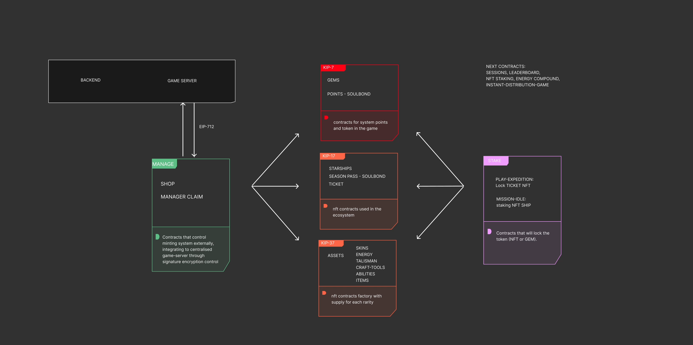

# Game Contracts README

\*We are going live on april 2024

## Overview

This repository contains the Solidity smart contracts that govern various aspects of our blockchain-based game. These contracts facilitate the creation, management, and interaction with in-game assets, transactions, and special features. Below is an overview of the key contracts and their purposes.
\*Due to security concern, the submission of the contracts has limited features, and intended for early architecture, and not the final code which is using upgradeable contract

### Smart Contracts

1. **GEMTOKEN or fUSD**

   - Address: `0x16F0EB9CD042e3D9e519baf660c18f4E8E4eF93e` (erc20)
   - Description: Manages the game's native token (GEMTOKEN or fake USD or any partner erc20 within the network) following the erc-20 standard.

2. **EXPOINTS**

   - Address: `0xFe9DF23d3EFAB6cC71D3395aFFB3aa505d1935eB` (erc-20)
   - Description: Handles experience points (EXPOINTS) based on the erc20 standard.

3. **NFT ASSETS**

   - Address: `0x9D2067BeB1c165FDE0F89E40Bd97f3276C153385` (ERC-1155)
   - Description: Manages non-fungible assets (NFTASSET) with unique identifiers following the ERC-1155 standard. This will be full available materials scattered inside the game as well as abilities and items as NFT.
   - update, new metadata consists of 200+ materials draft with 30 early abilities and items

4. **NFT STARSHIP**

   - Address: `0xC8E633D1Da2b23A12458682cB0d065A4452b6030` (ERC-721)
   - Description: Manages non-fungible starships (NFTSTARSHIP) following the ERC-721 standard.
   - Updated: starship now is 721 because each ship even with the same model could have different traits and different chain comes from, as well as earning experience which would grow in value.

5. **NFT PASS**

   - Address: `0xbe0833eB8f4Ff9BD5aEAFc2ee61925a227D58ABA` (ERC-1155)
   - Description: Manages non-fungible passes (NFTPASS) following the ERC-1155.
   - Updated: NFT Pass is now 1155, will be tradeable after activation time expired. So instead working as subscription, it will work just like other Game-PASS that will end in the end of season no matter what time user bought/mint it.

6. **NFT TICKET**

   - Address: `0xE39C0AAA925337a5499A2cCe0D906cc38B5CEA54` (ERC-721)
   - Description: Manages non-fungible tickets (NFTTICKET) following the ERC-721 standard.

7. **ClAIM OPERATOR**

   - Address: `0x9EcB83f041a8A3b76bcd9DafC078812047535ABc`
   - Description: Handles backend data management and securely mints NFTs to respective contracts. Allows users to claim NFTs through frontend using EIP712 signatures.

8. **EXPLOREPLAY**

   - Address: `0xa921a43516A0c85504d61bd3BD8bcE354a7bBEf1`
   - Description: Handles the ticket-NFTs when entering other dimensions and return the droprate in-game and after game

9. **SHOP**

   - Address: `0x5b6288be71623E408D61D0417A51572d7CBC10e2`
   - Description: Manages in-game shop logic, requiring correct token payments for products listed in the shop storage. This eventually will use eip-712 too for dynamic price and easier setup while not losing the security from offchain

10. **SWAP OPERATOR**

- Address: ``
- Description: SWAP token standard to the STAREX universal cross-chain token from backend using eip-712
  // currently not deployed due to sync with backend and progress only intended to show for Injective network and not cross-chain demo

11. **CRAFT OPERATOR** TBD

## Manager Claim

The Manager Claim contract is designed for managing backend data. When players acquire NFTs during gameplay, the data is recorded in the backend. The backend provides a signature for users to claim their pending NFTs through the frontend using EIP712. The Manager Claim contract securely mints these NFTs to the respective contracts.

## Shop Contract

Similar to the Manager Claim, the Shop contract manages backend data but requires correct token payments for products listed in the shop storage. Users can purchase in-game items by interacting with this contract.

## EXPEDITION-Play Contract

Users stake/lock their ticket-NFTs when attempting to enter other dimensions within the game. This contract governs the logic for this process.

## Season Pass

The Season Pass contract is similar to any SEASON PASS from mobile game, providing a time-limited soulbond token. It operates with the points-token (ERC-20) too, which can be earned through gameplay or purchased from the store. These points can later be used to acquire items in the shop.

## Future Integrations

Additional contracts will be introduced later. Stay tuned for updates on new features and functionalities.

For any inquiries or issues, please contact our development team.

