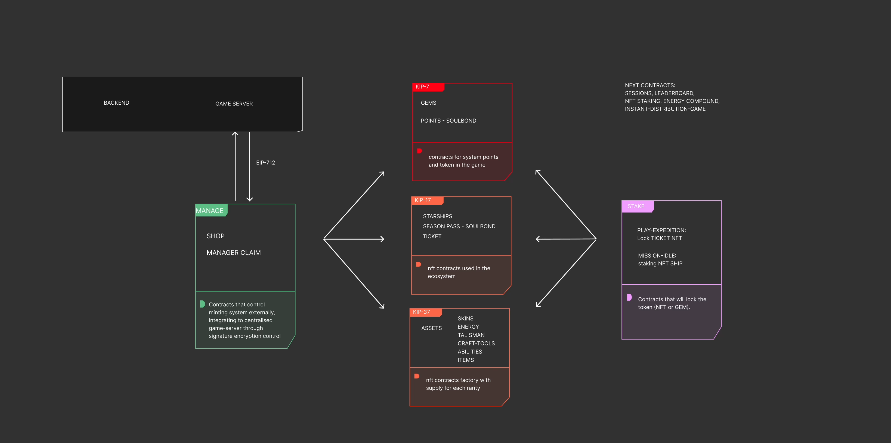

# Game Contracts README

## Viction Standard Update

When I tried the token viction standard, the fees feature for estimation and transfer didn't perform well. Additionally, the support on Discord was not very responsive in explaining the situation, along with the equivalent use case for multiple quantities of vrc725. In this hackathon, I will focus on a simple implementation until closer to the release process and then revamp the code quality to mitigate unexpected issues because I wasn't sure either with real world implication using vrc standard as it doesnt seem make such difference compare to ERC standard. Furthermore, some contracts haven't been implemented yet, such as VRF for our gacha system due to decision making it without chainlink system, or even staking, crafting, and swapping to universal cross-chain tokens. The team encourages making a simple implementation for the prototype and planning to progressively release it in a simple manner, moving forward to more advanced issues in the future.

## Overview

This repository contains the Solidity smart contracts that govern various aspects of our blockchain-based game. These contracts facilitate the creation, management, and interaction with in-game assets, transactions, and special features. Below is an overview of the key contracts and their purposes.
\*Due to security concern, the submission of the contracts has limited features, and not the final code

### Smart Contracts

1. **GEMTOKEN or fUSD**

   - Address: `0x9D2067BeB1c165FDE0F89E40Bd97f3276C153385` (vrc25)
   - Description: Manages the game's native token (GEMTOKEN or fake USD) following the vrc-25 standard.

2. **EXPOINTS**

   - Address: `0x16F0EB9CD042e3D9e519baf660c18f4E8E4eF93e` (vrc-25)
   - Description: Handles experience points (EXPOINTS) based on the vrc25 standard.

3. **NFTASSET**

   - Address: `0xE39C0AAA925337a5499A2cCe0D906cc38B5CEA54` (ERC-1155)
   - Description: Manages non-fungible assets (NFTASSET) with unique identifiers following the ERC-1155 standard.

4. **NFTSTARSHIP**

   - Address: `0x5b6288be71623E408D61D0417A51572d7CBC10e2` (ERC-1155)
   - Description: Manages non-fungible starships (NFTSTARSHIP) following the ERC-1155 standard.

5. **NFTPASS**

   - Address: `0xC8E633D1Da2b23A12458682cB0d065A4452b6030` (VRC-725)
   - Description: Manages non-fungible passes (NFTPASS) following the VRC-725standard.

6. **NFTTICKET**

   - Address: `0xbe0833eB8f4Ff9BD5aEAFc2ee61925a227D58ABA` (VRC-725)
   - Description: Manages non-fungible tickets (NFTTICKET) following the VRC-725 standard.

7. **MANAGERCLAIM**

   - Address: `0xa921a43516A0c85504d61bd3BD8bcE354a7bBEf1`
   - Description: Handles backend data management and securely mints NFTs to respective contracts. Allows users to claim NFTs through frontend using EIP712 signatures.

8. **EXPLOREPLAY**

   - Address: `0xed3f3e6eBf67cf360C5EF3f650e0E69CC3a70CAb`
   - Description: Handles the staking/locking of ticket-NFTs when entering other dimensions.

9. **SHOP**

   - Address: `0x9EcB83f041a8A3b76bcd9DafC078812047535ABc`
   - Description: Manages in-game shop logic, requiring correct token payments for products listed in the shop storage.

10. **ATOMIC SWAP**

- Address: `0x`
- Description: SWAP token standard to the STAREX universal cross-chain token from backend using eip-712

// due to newly with viction token standard, the prototype atomic swap isn't deployed yet

## Manager Claim

The Manager Claim contract is designed for managing backend data. When players acquire NFTs during gameplay, the data is recorded in the backend. The backend provides a signature for users to claim their pending NFTs through the frontend using EIP712. The Manager Claim contract securely mints these NFTs to the respective contracts.

## Shop Contract

Similar to the Manager Claim, the Shop contract manages backend data but requires correct token payments for products listed in the shop storage. Users can purchase in-game items by interacting with this contract.

## Explore-Play Contract

Users stake/lock their ticket-NFTs when attempting to enter other dimensions within the game. This contract governs the logic for this process.

## Season Pass

The Season Pass contract is similar to a subscription, providing a time-limited soulbond token. It operates similarly to the points-token (VRC-25), which can be earned through gameplay or purchased from the store. These points can later be used to acquire items in the shop.

## Future Integrations

Additional contracts will be introduced as the game progresses into beta around January 2024. Stay tuned for updates on new features and functionalities.

For any inquiries or issues, please contact our development team.

